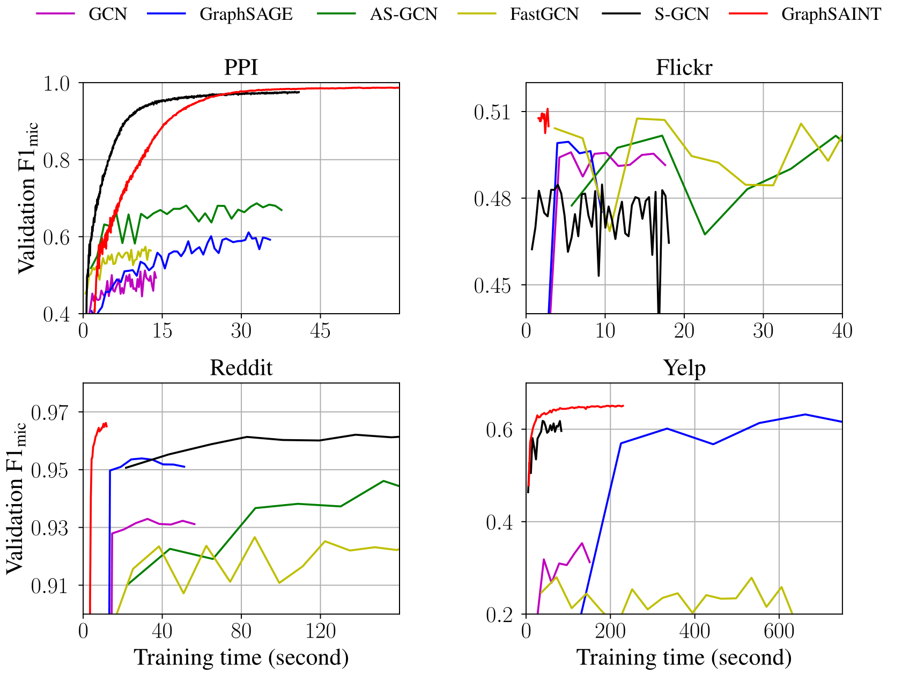
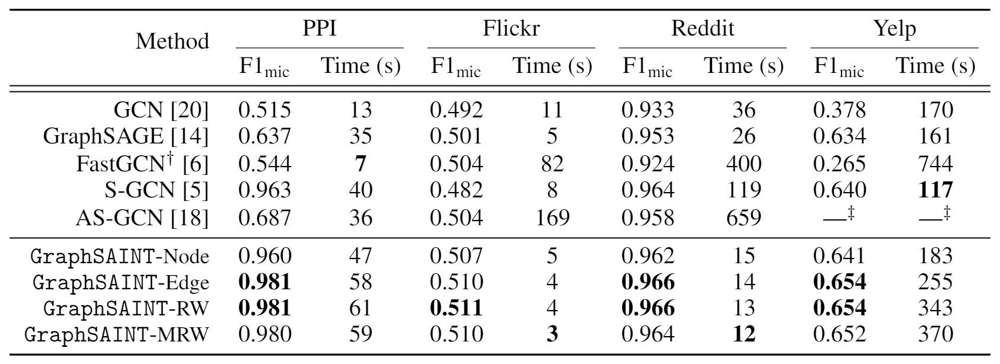

# GraphSAINT: Graph <u>Sa</u>mpling Based <u>In</u>ductive Learning Me<u>t</u>hod

This is the open source implementation for the "GraphSAINT" paper.


2 layer convergence (Validation F1-Micro w.r.t. Training time) plot
* The GraphSAINT curves correspond to samplers of RW, RW, RW, Edge for datasets PPI, Flickr, Reddit, Yelp. 



Comparison of test set accuracy and training time with state-of-the-art methods



Run configuration in `./train_config/table2/*.yml` to reproduce results in the above table. 

For results using **deeper GCNs** and **other architectures**, please see below. 

## Highlights in Flexibility

As stated in the paper, GraphSAINT can be easily extended to support various graph samplers, as well as other GCN architectures. 
To add customized sampler, just implement the new sampler class in `./graphsaint/cython_sampler.pyx`. 

We have integrated the following architecture variants into GraphSAINT in this codebase:

* **Higher order graph convolutional layers**: Just specify the order in the configuration file (see `./train_config/README.md`, and also `./train_config/explore/reddit2_o2_rw.yml` for an example order two GCN reaching 0.967 F1-micro). 
* **Jumping Knowledge connection**: The JK-Net in the [original paper](https://arxiv.org/abs/1806.03536) adopts the neighbor sampling strategy of GraphSAGE, where neighbor explosion in deeper layers is **not** resolved. Here, we demonstrate that graph sampling based minibatch of GraphSAINT can be applied to JK-Net architecture to improve training scalability w.r.t. GCN depth. 
* Check out `./train_config/explore/reddit4_jk_e.yml` for a 4-layer GraphSAINT-JK-Net achieving **0.970** F1-Micro on Reddit. The total training time (using independent edge sampler) is under 55 seconds, which is even 2x faster than 2-layer S-GCN!

Also, check out`./train_config/explore/ppi-large_5.yml` for a 5-layer GraphSAINT GCN achieving **0.995** F1-micro on the PPI-large dataset. 

## Dependencies

* python >= 3.6.8
* tensorflow >=1.12.0
* cython >=0.29.2
* numpy >= 1.14.3
* scipy >= 1.1.0
* scikit-learn >= 0.19.1
* pyyaml >= 3.12
* g++ >= 5.4.0
* openmp >= 4.0

## Dataset

Currently available datasets:

* PPI
* PPI-large (a larger version of PPI)
* Reddit
* Flickr
* Yelp
  
They are available via this [Google Drive link](https://drive.google.com/open?id=1zycmmDES39zVlbVCYs88JTJ1Wm5FbfLz). Rename the folder to `data` at the root directory.  The directory structure should be as below:

```
GraphSAINT/
│   README.md
│   run_graphsaint.sh
│   ... 
│
└───graphsaint/
│   │   models.py
│   │   train.py
│   │   ...
│   
└───data/
│   └───ppi/
│   │   │    adj_train.npz
│   │   │    adj_full.npz
│   │   │    ...
│   │   
│   └───reddit/
│   │   │    ...
│   │
│   └───...
│
```

We also have a script that converts datasets from our format to GraphSAGE format. To run the script,

`python convert.py <dataset name>`

For example `python convert.py ppi` will convert dataset PPI and save new data in GraphSAGE format to `./data.ignore/ppi/`
  


## Cython

We have a cython module which need compilation before training can start. Compile the module by running the following from the root directory:

`python graphsaint/setup.py build_ext --inplace`

## Training Configuration

The hyperparameters needed in training can be set via the configuration file: `./train_config/<name>.yml`.

The configuration files to reproduce the Table 2 results are packed in `./train_config/table2/`.

For detailed description of the configuration file format, please see `./train_config/README.md`

## Run Training

We suggest looking through the available tensorflow command line flags defined in `./graphsaint/globals.py`. By properly setting the flags, you can maximize CPU utilization in the sampling step (by telling the number of available cores), and turn on / off Tensorboard, etc. 

To run the code on cpu

`./run_graphsaint.sh <dataset_name> <path to train_config yml>`

To run the code on gpu

`./run_graphsaint.sh <dataset_name> <path to train_config yml> --gpu <GPU number>`

For example `--gpu 0` will run on the first GPU. 

We have also realized dual-GPU training to further speedup runtime. Simply add the flag `--dualGPU`.

